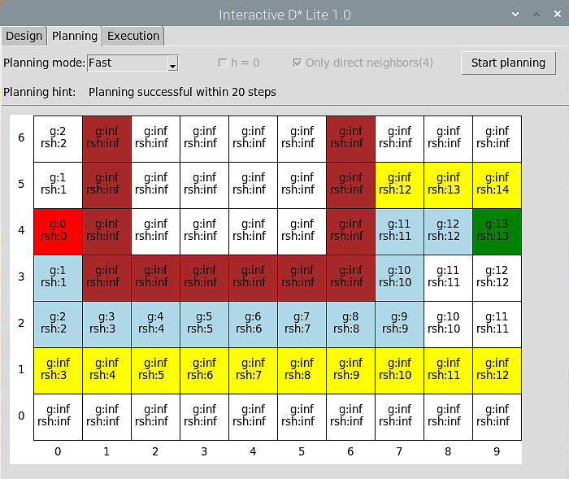

# Interactive-D-Star-Lite
Interactive path planning with D*Lite on Raspberry Pi for Lego EV3 robots

## Willkommen bei „Interactive D*Lite“(see English version below)
Diese Projekt realisiert ein interaktives Python Programm zur Pfadplanung für Lego-EV3-Robotern mit dem D* Lite Algorithmus (Koenig, Likhachev, 2002). Ein Operateur legt Start- und Zielfeld sowie bekannte Hindernisse fest. Danach ermittelt D* Lite den kürzesten Pfad zwischen Start- und Zielfeld. Der Pfadplan kann als Simulation ausgeführt werden. Der Operateur kann ungeplante Hindernisse auf dem Pfad einfügen und D* Lite plant dann automatisch eine neue Route.

Alternativ kann das Programm mit dem Pfadplan einen Lego EV3-Roboter über Bluetooth autonom steuern. Der Roboter meldet ungeplante Hindernisse auf dem Pfad und leitet eine Umplanung mit D* Lite über Bluetooth ein. Jedes Feld in der Feldmatrix ist 40x40cm groß. Die drei Videos in diesem Projekt zeigen den obigen Vorgang an einem Beispiel: Autonomes Servieren von Milchreis auf einer Terrasse mit einem leicht modifizierten TRACK3R. 

## Welcome to “Interactive D*Lite”
This project implements an interactive Python program for path planning for LEGO EV3 robots  with the D* Lite algorithm (Koenig, Likhachev, 2002). An operator defines the start and goal fields as well as known obstacles. Then D* Lite determines the shortest path between the start and goal fields. The path plan can be run as a simulation. An operator can add unplanned obstacles on the path and D* Lite plans automatically a new route. 

Alternatively, the program can control autonomously a Lego EV3 robot with the path plan using Bluetooth. The robot reports unplanned obstacles on the path and initiates replanning with D* Lite via Bluetooth. Each field in the field matrix is 40x40cm. The three videos in this project show the above process with an example: Serving autonomously rice pudding on a terrace with a littele bit modified TRACK3R. 
